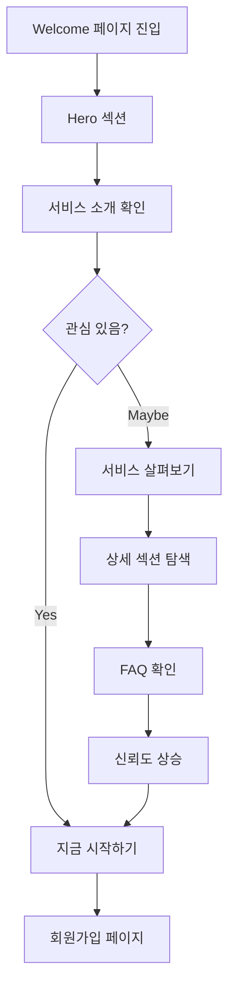
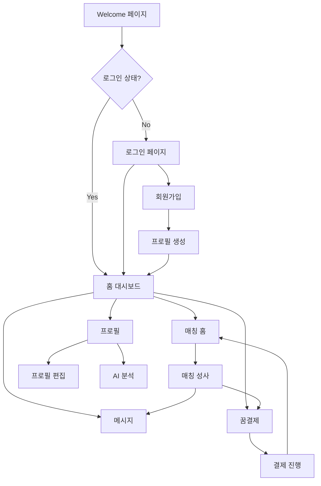

# MEE'BUD 페이지별 상세 기획 및 기능 분석

## 📋 문서 개요
이 문서는 MEE'BUD 서비스의 모든 페이지에 대한 상세한 기획, 기능, 디자인, 도메인 분석을 포함합니다.

---

## 🌐 도메인 구조 분석

### 메인 도메인
- **프로덕션**: https://meebud.com
- **개발**: localhost:3000
- **Vercel 프리뷰**: [branch-name]-meebud.vercel.app

### URL 구조 체계
```
meebud.com/
├── /                          # 홈 (로그인 후 대시보드)
├── /welcome                   # 서비스 소개 랜딩
├── /auth/
│   ├── /login                 # 로그인
│   └── /signup                # 회원가입
├── /matching/
│   ├── /                      # 매칭 홈 (카드 스와이프)
│   └── /history               # 매칭 히스토리
├── /messages/
│   ├── /                      # 메시지 리스트
│   └── /[id]                  # 개별 채팅방
├── /profile/
│   ├── /                      # 프로필 홈
│   ├── /edit                  # 프로필 편집
│   ├── /create                # 프로필 생성
│   └── /analysis              # AI 분석 결과
├── /dreams/
│   ├── /                      # 꿈결제 홈
│   ├── /purchase              # 결제하기
│   ├── /balance               # 잔액 관리
│   └── /history               # 결제 히스토리
├── /admin                     # 관리자 대시보드
└── /sitemap.xml               # SEO 사이트맵
```

---

## 📄 페이지별 상세 분석

## 1. 홈 페이지 (`/`)

### 📊 기획 의도
**목표**: 로그인한 사용자의 메인 허브이자 대시보드
**핵심 가치**: 한눈에 보는 매칭 현황과 빠른 액션 접근

### 🎯 타겟 사용자
- **주요**: 로그인한 활성 사용자
- **부차**: 비로그인 사용자 (로그인 유도)

### ⚙️ 핵심 기능
1. **조건부 렌더링**
   - 로그인 상태: 대시보드 표시
   - 비로그인 상태: 로그인 유도 화면

2. **모바일 최적화 대시보드**
   - 매칭 현황 한눈에 보기
   - 오늘의 AI 추천 강조
   - 진행 중인 매칭 상태 표시

3. **빠른 액션 버튼**
   - 프로필 완성 유도
   - 인증하기 버튼
   - 매칭 확인하기 CTA

4. **최근 활동 타임라인**
   - 매칭, 메시지, 인증 관련 알림
   - 실시간 업데이트 (UI 준비 완료)

### 🎨 디자인 특징
- **레이아웃**: 모바일 퍼스트 (max-width: 384px)
- **색상**: 브랜드 핑크 (#FF4D8D) 중심
- **카드 디자인**: rounded-2xl, shadow-sm 일관성
- **네비게이션**: 하단 고정 BottomNavigation

### 📱 반응형 설계
```scss
// 모바일 (기본)
.content-wrapper { @apply max-w-sm mx-auto px-4 py-6; }

// 태블릿 (768px+)
@media (min-width: 768px) {
  .content-wrapper { @apply max-w-md; }
}
```

### 🔗 연결 페이지
- `/matching` (매칭 확인)
- `/messages` (메시지)
- `/profile` (프로필)
- `/auth/login` (비로그인 시)

### 💾 상태 관리
```typescript
// 로컬 상태
const [isAuthenticated, setIsAuthenticated] = useState(false)
const [loading, setLoading] = useState(true)

// 세션 저장소 사용
sessionStorage.getItem('user_authenticated')
sessionStorage.getItem('user_email')
```

---

## 2. Welcome 페이지 (`/welcome`)

### 📊 기획 의도
**목표**: MEE'BUD 서비스의 차별화된 가치 전달
**핵심 메시지**: "가벼운 스와이프는 잊으세요. 인증·AI·성사형 후불제로 '진짜'를 잇습니다."

### 🎯 타겟 사용자
- **주요**: 첫 방문자, 서비스 탐색자
- **부차**: 기존 사용자 재확인

### ⚙️ 섹션별 상세 기능

#### Hero 섹션
**목적**: 첫인상과 핵심 메시지 전달
```typescript
// 핵심 요소
- 브랜드 로고 (하트 + MEE'BUD 타이포)
- 메인 헤드라인 (기획서 원문)
- 3가지 핵심 특징
- CTA 버튼 2개 (시작하기, 살펴보기)
```

#### WhyMeebud 섹션
**목적**: 차별화 포인트 3가지 강조
1. **🛡 다중 인증**: 신분·학력·직장·건강
2. **🤖 AI 이상형 매칭**: MBTI·가치관·취향 기반
3. **💳 성사형 후불제**: 성사된 연결에만 결제

#### HowItWorks 섹션
**목적**: 3단계 프로세스 설명
1. **프로필 작성**: 사진, 정보, 취향
2. **AI 분석**: 이상형 매칭 알고리즘
3. **매칭 & 결제**: 성사 시 결제 진행

#### TrustSafety 섹션
**목적**: 신뢰성과 안전성 어필
- 신분 인증 프로세스
- 운영진 검수 시스템
- 안전한 만남 보장

#### FAQ 섹션
**목적**: 주요 궁금증 해결
- 후불제 시스템 설명
- AI 매칭 원리
- 안전성 보장 방법

### 🎨 디자인 특징
- **애니메이션**: heart-beat, float, fade-in 효과
- **색상 그라데이션**: from-slate-50 to-blue-50
- **타이포그래피**: 4xl, 2xl, xl 단계적 크기
- **아이콘**: 이모지 활용 (🐶🐱✨)

### 📊 사용자 플로우


---

## 3. 인증 시스템

## 3-1. 로그인 페이지 (`/auth/login`)

### 📊 기획 의도
**목표**: 간편하고 신뢰할 수 있는 로그인 경험
**핵심**: 테스트 계정 제공으로 바로 체험 가능

### ⚙️ 핵심 기능
1. **테스트 계정 시스템**
```typescript
const TEST_ACCOUNTS = {
  'test@meebud.com': 'meebud123!',
  'demo@meebud.com': 'demo123!',
  'user@meebud.com': 'user123!'
}
```

2. **세션 기반 인증**
```typescript
// 로그인 성공 시
sessionStorage.setItem('user_authenticated', 'true')
sessionStorage.setItem('user_email', email)
router.push('/') // 홈으로 리다이렉트
```

3. **사용자 친화적 UI**
- 테스트 계정 안내 박스
- 실시간 에러 메시지
- 로딩 상태 표시

### 🎨 디자인 특징
- **레이아웃**: 중앙 정렬 카드 형태
- **폼 디자인**: 깔끔한 인풋 필드
- **브랜딩**: MEE'BUD 로고 상단 배치
- **색상**: 브랜드 핑크 포인트 컬러

## 3-2. 회원가입 페이지 (`/auth/signup`)

### 📊 기획 의도
**목표**: 간단하면서도 필수 정보 수집
**미래 계획**: 단계별 온보딩 프로세스

### 🚧 현재 상태
- 기본 구조 구현 완료
- 상세 기능은 백엔드 연동 후 구현 예정

---

## 4. 매칭 시스템

## 4-1. 매칭 홈 (`/matching`)

### 📊 기획 의도
**목표**: 틴더 스타일을 넘어선 심층적 매칭 경험
**차별점**: AI 호환성 점수와 상세 프로필 제공

### ⚙️ 핵심 기능
1. **카드 스와이프 시스템**
```typescript
// 매칭 액션
const handleSwipe = (direction: 'like' | 'pass') => {
  // 애니메이션 효과
  setSwipeDirection(direction)

  // 다음 카드로 이동
  setTimeout(() => {
    setCurrentIndex(currentIndex + 1)
  }, 300)
}
```

2. **상세 프로필 뷰**
- 기본 정보 (나이, 직업, 거주지)
- MBTI, 얼굴상 정보
- 호환성 점수 (AI 분석)
- 성격 태그, 취미
- 자기소개글

3. **액션 버튼**
- PASS (왼쪽 스와이프)
- LIKE (오른쪽 스와이프)
- SUPER LIKE (위쪽 스와이프)

### 📊 샘플 데이터 구조
```typescript
interface MatchProfile {
  id: number
  name: string
  age: number
  location: string
  job: string
  education: string
  height: number
  faceType: string
  mbti: string
  photos: string[]
  introduction: string
  personality: string[]
  hobbies: string[]
  compatibility: number // AI 호환성 점수
  isVerified: boolean
  distance: string
}
```

### 🎨 디자인 특징
- **카드 스타일**: 모바일 전체 화면 활용
- **그라데이션 배경**: from-purple-50 to-pink-50
- **호환성 표시**: 숫자 + 색상 조합
- **액션 버튼**: 하단 고정, 색상 구분

## 4-2. 매칭 히스토리 (`/matching/history`)

### 📊 기획 의도
**목표**: 매칭 기록 관리 및 재검토 기능
**가치**: 놓친 기회 재확인, 패턴 분석

### ⚙️ 핵심 기능 (계획)
1. **필터링 시스템**
   - 전체 / 매칭 성사 / 대기 중 / 거절됨
2. **재매칭 기능**
   - PASS했던 상대 재검토
3. **통계 제공**
   - 매칭 성사율
   - 선호 타입 분석

---

## 5. 메시지 시스템

## 5-1. 메시지 리스트 (`/messages`)

### 📊 기획 의도
**목표**: 모든 대화를 한눈에 관리
**핵심**: 읽지 않은 메시지 강조, 최신순 정렬

### ⚙️ 핵심 기능
1. **대화 목록 표시**
```typescript
// 메시지 상태별 분류
const conversations = [
  {
    id: 1,
    name: '지수님',
    lastMessage: '안녕하세요! 반가워요',
    timestamp: '30분 전',
    unreadCount: 2,
    isOnline: true,
    matchDate: '2일 전'
  }
]
```

2. **상태 인디케이터**
- 온라인/오프라인 표시
- 읽지 않은 메시지 카운트
- 매칭 성사 날짜

3. **빠른 액션**
- 메시지 전송 바로가기
- 프로필 다시보기
- 신고/차단 기능

### 🎨 디자인 특징
- **리스트 형태**: 프로필 사진 + 정보
- **읽음 상태**: 볼드 처리로 구분
- **온라인 표시**: 초록색 점
- **시간 표시**: 상대적 시간 (30분 전, 1시간 전)

## 5-2. 개별 채팅 (`/messages/[id]`)

### 📊 기획 의도
**목표**: 자연스럽고 안전한 소통 환경
**특징**: 첫 매칭 축하 메시지, 안전 가이드

### ⚙️ 핵심 기능
1. **채팅 인터페이스**
- 말풍선 형태 메시지
- 시간 표시
- 읽음 확인

2. **매칭 정보 표시**
- 상대방 프로필 미리보기
- 매칭 성사 축하 메시지
- 호환성 점수 재확인

3. **안전 기능** (계획)
- 신고하기 버튼
- 차단 기능
- 부적절한 내용 자동 감지

---

## 6. 프로필 관리 시스템

## 6-1. 프로필 홈 (`/profile`)

### 📊 기획 의도
**목표**: 내 프로필 현황 한눈에 보기
**핵심**: 완성도 표시, 매칭률 향상 가이드

### ⚙️ 핵심 기능
1. **프로필 미리보기**
- 상대방이 보는 내 모습
- 매력도 점수 표시
- 인증 뱃지 상태

2. **완성도 체크**
- 필수/선택 항목 구분
- 완성률 퍼센테이지
- 개선 제안 사항

3. **통계 정보**
- 조회수, 관심 표시 수
- 매칭 성사 횟수
- 인기도 순위

## 6-2. 프로필 편집 (`/profile/edit`)

### 📊 기획 의도
**목표**: 사용자 친화적인 프로필 관리
**특징**: 탭 기반 구성, 실시간 미리보기

### ⚙️ 핵심 기능
1. **3단계 탭 시스템**
```typescript
// 탭 구성
const tabs = [
  'basic',      // 기본정보
  'photos',     // 사진관리
  'preferences' // 이상형 설정
]
```

2. **기본정보 탭**
- 키, 직업, 거주지
- 자기소개 (500자 제한)
- 성격 선택 (최대 4개)
- 취미 선택 (최대 6개)
- MBTI 입력

3. **사진관리 탭**
- 대표 사진 설정
- 추가 사진 4장
- 사진 팁 제공

4. **이상형 탭**
- 나이대 슬라이더
- 선호 얼굴상 (다중 선택)
- 설정 팁 제공

### 📊 데이터 구조
```typescript
interface ProfileData {
  // 기본 정보
  name: string
  age: number
  height: number
  job: string
  education: string
  location: string
  introduction: string

  // 성향
  personality: string[]  // 최대 4개
  hobbies: string[]      // 최대 6개
  mbti: string

  // 이상형 설정
  idealAgeMin: number
  idealAgeMax: number
  idealTypes: string[]
}
```

## 6-3. 프로필 생성 (`/profile/create`)

### 📊 기획 의도
**목표**: 신규 사용자 온보딩
**특징**: 단계별 안내, 진행률 표시

### 🚧 현재 상태
- 기본 UI 구조 완성
- 단계별 프로세스 구현 예정

## 6-4. AI 분석 (`/profile/analysis`)

### 📊 기획 의도
**목표**: AI가 분석한 내 매력 포인트 제공
**차별점**: 개인화된 매칭 전략 제안

### ⚙️ 핵심 기능 (계획)
1. **얼굴상 분석**
- AI 기반 얼굴상 분류
- 매력 포인트 분석
- 개선 제안

2. **성격 분석**
- MBTI 기반 성격 해석
- 상성 좋은 타입 추천
- 어필 포인트 제안

3. **매칭 전략**
- 개인별 맞춤 전략
- 성공률 높은 접근법
- 프로필 최적화 가이드

---

## 7. 꿈결제 시스템

## 7-1. 꿈결제 홈 (`/dreams`)

### 📊 기획 의도
**목표**: 투명하고 합리적인 결제 시스템 설명
**핵심 가치**: 성사형 후불제의 공정함

### ⚙️ 핵심 기능
1. **결제 현황 대시보드**
- 현재 포인트 잔액
- 이번 달 사용 내역
- 결제 예정 금액

2. **후불제 시스템 설명**
- 성사 시에만 결제
- 투명한 과금 구조
- 환불 정책 안내

### 🎨 디자인 특징
- **색상**: 파란색-보라색 그라데이션
- **아이콘**: 구름(☁️), 별(⭐) 테마
- **카드**: 깔끔한 정보 표시

## 7-2. 결제하기 (`/dreams/purchase`)

### 📊 기획 의도
**목표**: 4단계 체계적인 결제 프로세스
**특징**: 단계별 명확한 안내

### ⚙️ 4단계 결제 시스템
```typescript
// 결제 단계
const paymentSteps = [
  '매칭 확인',    // 결제 대상 매칭 확인
  '포인트 선택',  // 필요 포인트 계산
  '결제 방법',    // PG사 선택
  '결제 완료'     // 완료 및 안내
]
```

1. **1단계: 매칭 확인**
- 결제 대상 매칭 리스트
- 각 매칭별 필요 포인트
- 총 결제 금액 계산

2. **2단계: 포인트 선택**
- 포인트 패키지 옵션
- 할인 혜택 안내
- 사용 기간 안내

3. **3단계: 결제 방법**
- 신용카드, 계좌이체 등
- 할부 옵션
- 보안 인증

4. **4단계: 결제 완료**
- 결제 성공 확인
- 영수증 발행
- 다음 단계 안내

## 7-3. 잔액 관리 (`/dreams/balance`)

### 📊 기획 의도
**목표**: 포인트 관리의 투명성
**기능**: 충전, 환불, 사용 내역

### ⚙️ 핵심 기능
1. **잔액 현황**
- 보유 포인트
- 사용 예정 포인트
- 환불 가능 포인트

2. **충전 시스템**
- 포인트 패키지
- 보너스 혜택
- 결제 방법 선택

3. **환불 시스템**
- 환불 신청
- 환불 정책 안내
- 처리 현황 확인

## 7-4. 결제 히스토리 (`/dreams/history`)

### 📊 기획 의도
**목표**: 모든 거래 내역의 투명한 관리
**특징**: 상세한 분류 및 필터링

### ⚙️ 핵심 기능
1. **거래 내역 분류**
```typescript
// 거래 유형
type TransactionType =
  | 'charge'   // 충전
  | 'use'      // 사용
  | 'refund'   // 환불
  | 'bonus'    // 보너스
```

2. **필터링 시스템**
- 기간별 조회
- 유형별 분류
- 금액대별 검색

3. **상세 정보**
- 거래 일시
- 매칭 정보 (사용 시)
- 결제 방법
- 상태 (완료/취소/환불)

---

## 8. 관리자 시스템 (`/admin`)

### 📊 기획 의도
**목표**: 서비스 운영 및 관리 효율성
**대상**: 운영진, 관리자

### ⚙️ 핵심 기능
1. **사용자 관리**
- 회원 목록 및 상태
- 인증 승인/거부
- 신고 처리

2. **매칭 관리**
- 매칭 현황 모니터링
- 성사율 통계
- 문제 매칭 처리

3. **결제 관리**
- 결제 현황 조회
- 환불 처리
- 수익 통계

4. **컨텐츠 관리**
- 공지사항 관리
- FAQ 업데이트
- 정책 변경

### 🎨 디자인 특징
- **대시보드 스타일**: 정보 밀도 높은 레이아웃
- **차트/그래프**: 시각적 데이터 표현
- **테이블**: 정렬/필터 기능
- **액션 버튼**: 승인/거부/처리 버튼

---

## 🎨 통합 디자인 시스템

### 색상 체계 상세
```scss
// Primary Brand Colors
$brand-primary: #FF4D8D;      // MEE'BUD 핑크
$brand-primary-hover: #ff3080; // 호버 상태
$brand-primary-light: #FFB3D1; // 연한 핑크
$brand-primary-dark: #E6456F;  // 진한 핑크

// Secondary Colors
$brand-secondary: #0D1B2A;     // 네이비 (신뢰감)
$brand-accent: #ADB5BD;        // 중성 그레이
$brand-supporting: #C49A6C;    // 골드 (프리미엄)

// Functional Colors
$success: #10B981;             // 성공 (초록)
$warning: #F59E0B;             // 경고 (노랑)
$error: #EF4444;               // 에러 (빨강)
$info: #3B82F6;                // 정보 (파랑)

// Text Hierarchy (접근성 개선)
$text-primary: #111827;        // 제목 (gray-900)
$text-secondary: #1F2937;      // 부제목 (gray-800)
$text-body: #374151;           // 본문 (gray-700)
$text-caption: #4B5563;        // 캡션 (gray-600)
$text-disabled: #9CA3AF;       // 비활성 (gray-400)

// Background Colors
$bg-primary: #FFFFFF;          // 메인 배경
$bg-secondary: #F9FAFB;        // 보조 배경 (gray-50)
$bg-elevated: #F3F4F6;         // 카드 배경 (gray-100)
$bg-overlay: rgba(0,0,0,0.5);  // 오버레이
```

### 타이포그래피 시스템
```scss
// Heading Styles
.text-display-lg { font-size: 3.5rem; font-weight: 700; } // 56px
.text-display-md { font-size: 3rem; font-weight: 700; }   // 48px
.text-display-sm { font-size: 2.5rem; font-weight: 700; } // 40px

.text-heading-xl { font-size: 2rem; font-weight: 600; }   // 32px
.text-heading-lg { font-size: 1.5rem; font-weight: 600; } // 24px
.text-heading-md { font-size: 1.25rem; font-weight: 600; }// 20px
.text-heading-sm { font-size: 1rem; font-weight: 600; }   // 16px

// Body Text
.text-body-lg { font-size: 1rem; font-weight: 400; }      // 16px
.text-body-md { font-size: 0.875rem; font-weight: 400; }  // 14px
.text-body-sm { font-size: 0.75rem; font-weight: 400; }   // 12px

// Specialized
.text-caption { font-size: 0.625rem; font-weight: 500; }  // 10px
.text-overline { font-size: 0.75rem; font-weight: 700; text-transform: uppercase; }
```

### 간격(Spacing) 시스템
```scss
// Spacing Scale (Tailwind 기반)
$space-0: 0;      // 0px
$space-1: 0.25rem; // 4px
$space-2: 0.5rem;  // 8px
$space-3: 0.75rem; // 12px
$space-4: 1rem;    // 16px
$space-6: 1.5rem;  // 24px
$space-8: 2rem;    // 32px
$space-12: 3rem;   // 48px
$space-16: 4rem;   // 64px
$space-20: 5rem;   // 80px
```

### 그림자(Shadow) 시스템
```scss
// Shadow Levels
.shadow-sm { box-shadow: 0 1px 2px rgba(0,0,0,0.05); }
.shadow-md { box-shadow: 0 4px 6px rgba(0,0,0,0.07); }
.shadow-lg { box-shadow: 0 10px 15px rgba(0,0,0,0.1); }
.shadow-xl { box-shadow: 0 20px 25px rgba(0,0,0,0.15); }

// Brand Shadows
.shadow-brand { box-shadow: 0 4px 20px rgba(255,77,141,0.3); }
.shadow-brand-lg { box-shadow: 0 8px 30px rgba(255,77,141,0.4); }
```

---

## 📱 반응형 디자인 가이드라인

### 브레이크포인트 정의
```scss
// Mobile First Approach
$mobile: 320px;    // 기본
$mobile-lg: 480px; // 큰 모바일
$tablet: 768px;    // 태블릿
$desktop: 1024px;  // 데스크톱
$desktop-lg: 1280px; // 큰 데스크톱

// Media Queries
@mixin mobile-lg { @media (min-width: #{$mobile-lg}) { @content; } }
@mixin tablet { @media (min-width: #{$tablet}) { @content; } }
@mixin desktop { @media (min-width: #{$desktop}) { @content; } }
@mixin desktop-lg { @media (min-width: #{$desktop-lg}) { @content; } }
```

### 컨테이너 시스템
```scss
// 페이지별 컨테이너
.container-mobile { max-width: 384px; margin: 0 auto; padding: 0 1rem; }
.container-tablet { max-width: 640px; margin: 0 auto; padding: 0 1.5rem; }
.container-desktop { max-width: 1024px; margin: 0 auto; padding: 0 2rem; }

// 특수 컨테이너
.container-welcome { max-width: 480px; margin: 0 auto; }
.container-auth { max-width: 400px; margin: 0 auto; }
.container-admin { max-width: 1200px; margin: 0 auto; }
```

---

## 🔗 페이지 간 연결 흐름

### 주요 사용자 플로우


### URL 라우팅 규칙
1. **RESTful 설계 원칙 적용**
2. **명사 기반 URL 구조**
3. **계층적 구조 유지**
4. **SEO 친화적 네이밍**

---

## 📊 성능 최적화 전략

### 이미지 최적화
```typescript
// Next.js Image 컴포넌트 활용
import Image from 'next/image'

// WebP 포맷 우선 사용
// 적절한 크기별 최적화
// Lazy loading 기본 적용
```

### 코드 스플리팅
```typescript
// 페이지별 동적 임포트
const DashboardPage = dynamic(() => import('./dashboard/page'))
const MatchingPage = dynamic(() => import('./matching/page'))

// 컴포넌트별 최적화
const HeavyComponent = lazy(() => import('./HeavyComponent'))
```

### 캐싱 전략
```typescript
// API 응답 캐싱
// Static Generation 최대 활용
// 이미지 CDN 활용
```

---

## 🚀 향후 개발 계획

### 단기 목표 (1-2개월)
1. **백엔드 API 연동**
   - 사용자 인증 시스템
   - 프로필 CRUD
   - 매칭 알고리즘 v1.0

2. **실시간 기능**
   - 채팅 시스템
   - 푸시 알림
   - 온라인 상태

### 중기 목표 (3-6개월)
1. **AI 고도화**
   - 얼굴 인식 기술
   - 성격 분석 알고리즘
   - 매칭 성공률 학습

2. **결제 시스템**
   - PG사 연동
   - 포인트 시스템
   - 정기결제

### 장기 목표 (6개월+)
1. **확장 기능**
   - 영상 채팅
   - 그룹 매칭
   - 이벤트 기능

2. **글로벌 진출**
   - 다국어 지원
   - 해외 결제 수단
   - 현지화 기능

---

*이 문서는 MEE'BUD 프로젝트의 상세한 페이지별 분석서입니다. 개발 진행에 따라 지속적으로 업데이트됩니다.*

**마지막 업데이트**: 2025년 9월 24일
**문서 버전**: 1.0
**작성자**: Claude Code